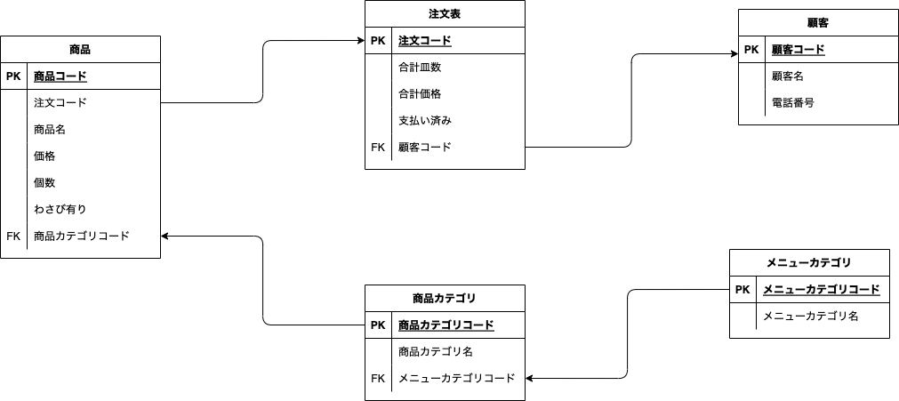

## 回答 1

### 解説

###　物理モデルと論理モデルの違い

## 任意課題

### 論理モデルとは？

ある対象を理解するために図などを用いた表現のこと

### 物理モデルとは？

物理モデルとは、対象の実体に近い詳細な表現を用いた図など
例えば不動産屋さんの店先に掲示されている家の間取り図は論理モデル、壁やドアの材料・色・寸法などを細かく記載した図は物理モデルと言えるでしょう。

### それぞれの違いは？

機能の表現が論理モデル、仕様の表現あるいは設計図が物理モデルとも言えます。
