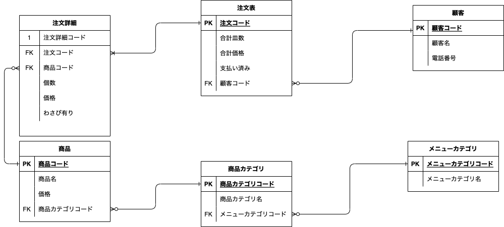
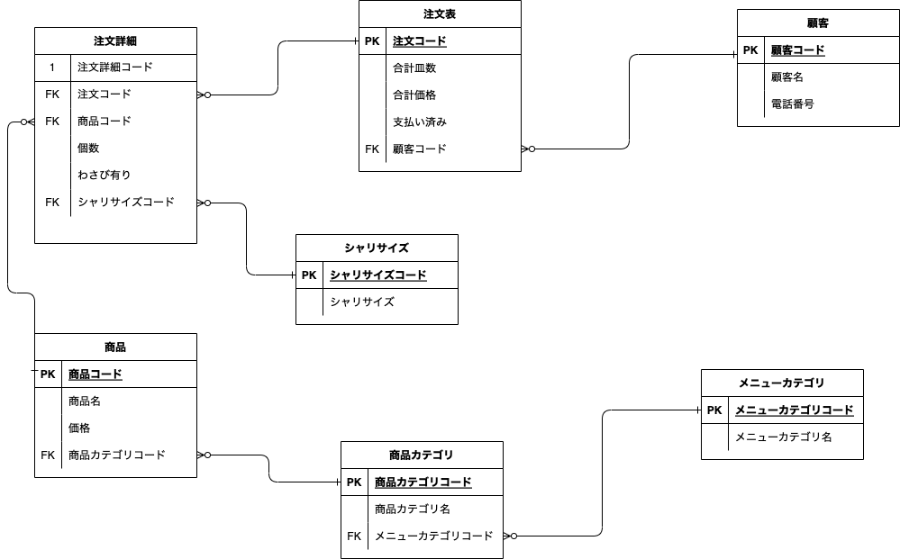
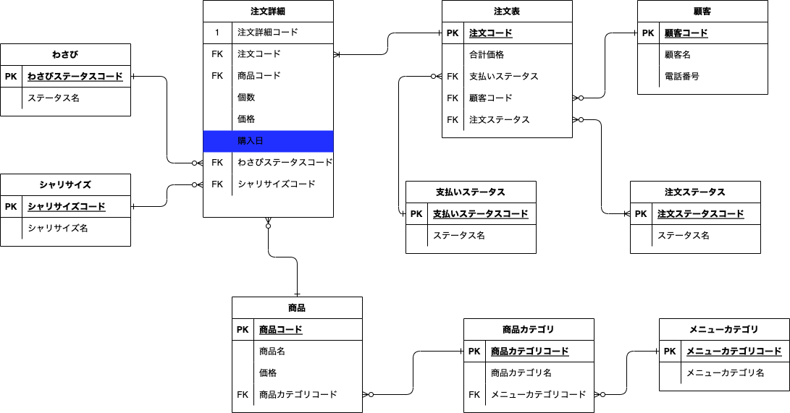

# 回答1

## 解説

## 任意課題

### 論理モデルとは？

別名：概念スキーマ

論理モデルとは、ある対象を理解するために図などを用いた表現のことである。

システムの世界での論理とは、「物理層にとらわれない」という意味で使用される。
なので論理モデルを作成する際は、データベースの仕様やデータ型や SQL 構文のような具体的な実装レベルの制約を受けないことを前提に行う。

なお、データベースの設計では、物理モデルを作成をする前に、論理モデルを作成することが一般的。

また、論理モデルの設計のステップは以下になる。

1. エンティティの抽出
2. エンティティの定義
3. 正規化
4. ER 図の作成

### 物理モデルとは？

別名：内部スキーマ

物理モデルとは、論理モデルを元に、データを格納するための物理的な領域や格納方法を決める工程。

物理モデルの工程を行うためには、DBMS などの知識が必要になってくる。

また、物理モデルの設計のステップは以下になる。

1. テーブルの定義
2. インデックスの定義
3. ハードウェアのサイジング
4. ストレージの冗長構成決定
5. ファイルの物理配置決定

### それぞれの違いは？

大きな違いは、ハードウェアや DBMS のような物理的な制約を考慮しているか否かである。

# 回答 2

## 今後はわさびの有無のみならずシャリの大小も選べるようになった場合のスキーマ

### 解説

## 人気の寿司ネタを特定したいので、「はな」「わだつみ」などのセット商品の売り上げとは別に、寿司ネタが毎月何個売れているのか知る必要が生じました。どのようにテーブル設計をするべきでしょうか?

### 解説

注文詳細テーブルに「購入日」を追加。
追加した「購入日」の日付を元に、毎月の人気のすしネタをカウントする。

**なぜ、詳細テーブルのデータ登録日とは別に、購入日を追加した？**
データ自体の登録日でもカウントできるかもしれないが、今後、「予約できる」という要件が追加された場合に、注文データ登録の日付と、実際にすしが購入される日付がずれる場合が発生する可能性を考慮して「購入日」を追加した。
